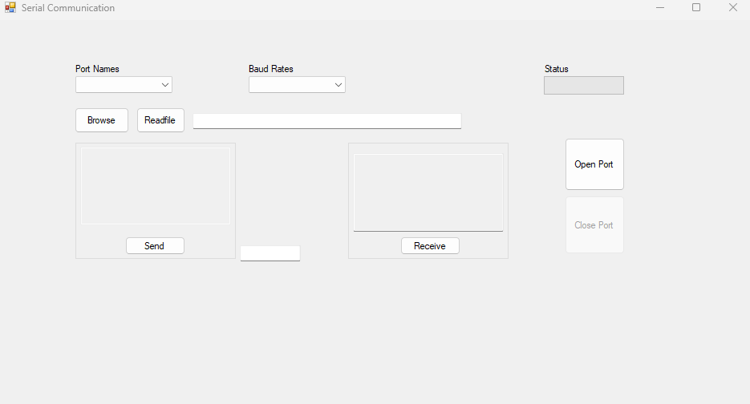

# FPGA-Based Out-of-Band Encryption Module with Key Management System


A Zynq-7000 based encryption workflow that combines FPGA hardware acceleration, bare-metal firmware, and a Windows host application to move AES data over UART and execute encryption/decryption through a hardware-backed path.

> **Project Outcome:** Built and integrated an end-to-end AES-256 demo flow across Vivado, Vitis, and WinForms, with validated host-side inputs, memory-mapped firmware control, and reusable sample vectors for hardware bring-up.

## Table of Contents

1. [Project Overview](#project-overview)
2. [Why This Project Matters](#why-this-project-matters)
3. [System Architecture](#system-architecture)
4. [Result Metrics](#result-metrics)
5. [Project Gallery](#project-gallery)
6. [Quick Start](#quick-start)
7. [Repository Structure](#repository-structure)
8. [Key Implementation Notes](#key-implementation-notes)
9. [UART Protocol](#uart-protocol)
10. [Sample Test Vectors](#sample-test-vectors)
11. [Tooling Requirements](#tooling-requirements)
12. [Verification Notes](#verification-notes)

## Project Overview

This repository captures a complete FPGA-oriented security workflow rather than a single algorithm demo. The system is split across three layers:

- **Programmable logic / hardware design** built in Vivado.
- **Bare-metal firmware** in Vitis that drives the AES data path through memory-mapped I/O.
- **Windows desktop host software** that prepares data, validates user input, and exchanges payloads with the board over UART.

The result is a practical embedded security project that demonstrates hardware/software co-design, host-to-device communication, and structured validation around AES-256 key and data handling.

## Why This Project Matters

This project is portfolio-relevant because it demonstrates work across the full embedded stack instead of staying in only one layer:

- Hardware design integration on a Xilinx Zynq platform.
- Firmware-level control of encryption/decryption through MMIO.
- Desktop application support for operator-driven testing.
- Input validation and debugging improvements that make the flow safer to run and easier to demo.
- Reproducible sample vectors for bring-up and regression checks.

## System Architecture

```text
PC WinForms App
   |
   | UART
   v
Zynq Processing System (firmware in Vitis)
   |
   | AXI / MMIO register access
   v
AES hardware path in programmable logic
   |
   v
Encrypted / decrypted block response
```

### Workflow Summary

1. The host application loads AES key, plaintext, and ciphertext test files.
2. Payloads are validated before transmission to avoid malformed UART input.
3. Firmware receives the data, parses hex safely, and writes values through the hardware interface.
4. The FPGA-backed AES path performs the encrypt/decrypt operation.
5. Firmware returns status markers and result words for host-side inspection.

## Result Metrics

| Area | Result |
| --- | --- |
| Encryption key input | 256-bit AES key format enforced (64 hex characters) |
| Data block input | 128-bit plaintext/ciphertext format enforced (32 hex characters) |
| Host validation | File payload checks added before serial transmission |
| Firmware robustness | Hex parsing hardened and MMIO access handled with `volatile` semantics |
| Output visibility | Full 32-bit decrypted words printed for easier debugging |
| Workflow coverage | Vivado hardware -> Vitis firmware -> WinForms host application |
| Demo readiness | Sample vectors included for first-pass bring-up |
| Validation status | Source-level integration completed; final runtime proof depends on local FPGA hardware setup |

## Project Gallery

### Banner / Hardware View

The banner above highlights the top-level Vivado design used for system integration.

### Host Application Screenshot



### Additional Design Assets

The `assets/images/` directory also includes timing captures, block design screenshots, and Vitis application views that can be reused for reports or presentations.

## Quick Start

Follow this order for a normal end-to-end run.

### 1. Build hardware in Vivado

- Open `backup files/project_22/project_22.xpr`.
- Validate and inspect the block design under `backup files/project_22/project_22.srcs/`.
- Run synthesis and implementation.
- Generate the bitstream.
- Confirm the exported hardware handoff exists at `backup files/project_22/design_1_wrapper.xsa`.

### 2. Build firmware in Vitis

- Open the Vitis workspace at `backup files/project_22/`.
- Platform project: `backup files/project_22/platform/`.
- Application project: `backup files/project_22/hello_world/`.
- Main firmware file: `backup files/project_22/hello_world/src/helloworld.c`.
- Build the application and generate the ELF output.

### 3. Run the Windows host application

- Open `backup files/WindowsFormsApplication1/WindowsFormsApplication1.sln` in Visual Studio.
- Main UI logic lives in `backup files/WindowsFormsApplication1/WindowsFormsApplication1/Form1.cs`.
- Launch the app, select the active COM port, and load files from `samples/uart/`.

### 4. Test with the included vectors

- Key file: `samples/uart/key_256.txt`
- Plaintext file: `samples/uart/plain_text.txt`
- Ciphertext file: `samples/uart/cipher_text.txt`
- Optional UART capture: `samples/uart/output.txt`

## Repository Structure

```text
.
+- README.md
+- assets/
¦  +- images/                         # screenshots, timing views, block diagrams
+- docs/
¦  +- notes/                          # experiment notes and archived text backups
¦  ¦  +- legacy/
¦  +- reports/                        # reports, slides, and supporting project documents
+- samples/
¦  +- uart/
¦     +- key_256.txt
¦     +- plain_text.txt
¦     +- cipher_text.txt
¦     +- output.txt
+- backup files/
   +- project_22/                     # Vivado and Vitis workspace snapshot
   ¦  +- hello_world/
   ¦  ¦  +- src/                      # editable firmware source
   ¦  ¦  +- build/                    # generated
   ¦  ¦  +- _ide/                     # generated
   ¦  +- platform/                    # Vitis platform and BSP outputs
   ¦  +- project_22.srcs/             # source-managed Vivado design sources
   ¦  +- project_22.runs/             # generated synthesis and implementation outputs
   ¦  +- project_22.gen/              # generated IP output products
   ¦  +- logs/                        # generated logs
   +- WindowsFormsApplication1/
      +- WindowsFormsApplication1.sln
      +- WindowsFormsApplication1/    # C# host application source
```

### Main Files to Review First

#### Firmware

- `backup files/project_22/hello_world/src/helloworld.c` - UART receive/transmit flow and AES hardware register interaction.
- `backup files/project_22/hello_world/src/platform.c` - Platform initialization helpers.
- `backup files/project_22/hello_world/src/platform.h` - Shared firmware declarations.
- `backup files/project_22/hello_world/src/UserConfig.cmake` - Vitis build configuration.
- `backup files/project_22/hello_world/src/lscript.ld` - Firmware linker script.

#### Hardware

- `backup files/project_22/project_22.xpr` - Main Vivado project file.
- `backup files/project_22/project_22.srcs/` - Source-managed Vivado design files.
- `backup files/project_22/design_1_wrapper.xsa` - Exported hardware handoff for Vitis.

#### Windows Host App

- `backup files/WindowsFormsApplication1/WindowsFormsApplication1.sln` - Visual Studio solution.
- `backup files/WindowsFormsApplication1/WindowsFormsApplication1/Form1.cs` - Main UI and serial workflow logic.
- `backup files/WindowsFormsApplication1/WindowsFormsApplication1/Program.cs` - Application entry point.
- `backup files/WindowsFormsApplication1/WindowsFormsApplication1/WindowsFormsApplication1.csproj` - Project configuration.

## Key Implementation Notes

- Firmware now validates incoming hex characters before processing payloads.
- Memory-mapped register access was tightened using `volatile` access patterns.
- Decryption output is printed as full 32-bit words to improve inspection during bring-up.
- The WinForms host app validates payload lengths before sending data.
- `UserConfig.cmake` was corrected so linker options propagate as intended.

## UART Protocol

The implemented firmware loop expects payloads in the following order:

1. `RDY_KEY` -> send 64 hex characters for the AES-256 key.
2. `ACK_KEY`
3. `RDY_PT` -> send 32 hex characters for the plaintext block.
4. `ACK_PT`
5. Firmware prints key, plaintext, and ciphertext echo lines.
6. `RDY_CT` -> send 32 hex characters for the ciphertext block used in decrypt testing.
7. `ACK_CT`
8. Firmware prints the decrypted plaintext line.

Whitespace and newlines in the payload files are accepted and ignored during hex parsing.

## Sample Test Vectors

- `samples/uart/key_256.txt` -> `000102030405060708090A0B0C0D0E0F101112131415161718191A1B1C1D1E1F`
- `samples/uart/plain_text.txt` -> `00112233445566778899AABBCCDDEEFF`
- `samples/uart/cipher_text.txt` -> `8EA2B7CA516745BFEAFC49904B496089`
- `samples/uart/output.txt` -> optional UART capture file

For a correct AES-256 hardware implementation, encrypting the sample plaintext with the sample key is expected to produce `8EA2B7CA516745BFEAFC49904B496089`.

## Tooling Requirements

- Xilinx Vivado and Vitis for hardware and bare-metal firmware builds.
- Visual Studio or an equivalent .NET Framework-capable setup for the WinForms application.
- The C# host project targets `.NET Framework 4.0 Client`.

## Verification Notes

- The repository reflects source-level fixes and integration improvements.
- Full end-to-end confirmation still requires a local FPGA board, bitstream, Vitis runtime, and working serial connection.
- The committed repository also contains historical generated outputs under `backup files/project_22/`; these are useful for reference but are not the primary source files to edit.

Prepared by Uzair Ashfaq, updated March 2026.
